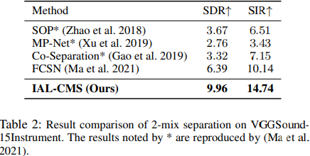
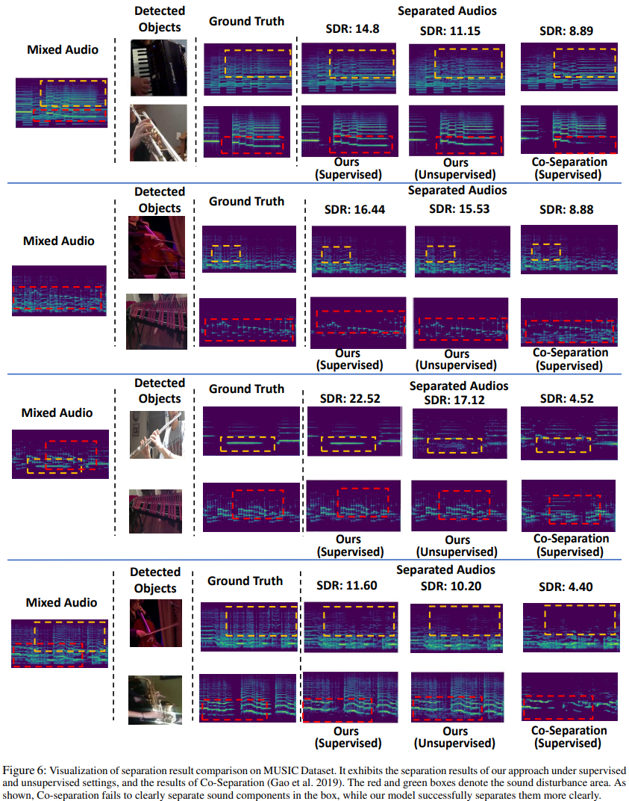

# Independency-Adversarial-Learning-for-Cross-modal-Sound-Separation
Independency Adversarial Learning for Cross-modal Sound Separation

'''
Unsupervised Training on MUSIC
python main.py --batch_size 8 --num_workers 4 --gpus 0 --num_sanity_val_steps 2 --max_epochs -1 --vis_root Visualization/SyntheticDuet/IAL-CMS --n_visualize 800 --train_dataset SyntheticDuet --algorithm IAL-CMS --lmconfig config/lm/IAL-CMS/AdaversarialTraining/GeometricGANwAVC.yaml --lambda_independence_incresing_step 8000 16000 24000 --lambda_avc_incresing_step 4000 8000 12000 
'''

'''
Unsupervised Separation Evaluation on MUSIC
python main.py --test "1" --checkpoint path_2_checkpoint  --batch_size 8 --num_workers 4 --gpus 0 --num_sanity_val_steps 2 --max_epochs -1 --vis_root Visualization/Test/SyntheticDuet/IAL-CMS --n_visualize 800 --train_dataset SyntheticDuet --algorithm IAL-CMS --lmconfig config/lm/IAL-CMS/AdaversarialTraining/GeometricGANwAVC.yaml
'''

'''
Supervised Training on MUSIC
python main.py --batch_size 8 --num_workers 4 --gpus 0 --num_sanity_val_steps 2 --max_epochs -1 --vis_root Visualization/MUSIC-Solo/IAL-CMS --n_visualize 800 --train_dataset MUSIC-Solo --algorithm IAL-CMS --lmconfig config/lm/IAL-CMS/OnlySep/OnlySep_Spatial_Channel_AdaIN.yaml  --lambda_avc_incresing_step 4000 8000 12000 
'''

'''
Supervised Separation Evaluation on MUSIC
python main.py --test "1" --checkpoint path_2_checkpoint --batch_size 8 --num_workers 4 --gpus 0 --num_sanity_val_steps 2 --max_epochs -1 --vis_root Visualization/Test/MUSIC-Solo/IAL-CMS --n_visualize 800 --train_dataset MUSIC-Solo --algorithm IAL-CMS --lmconfig config/lm/IAL-CMS/OnlySep/OnlySep_Spatial_Channel_AdaIN.yaml
'''